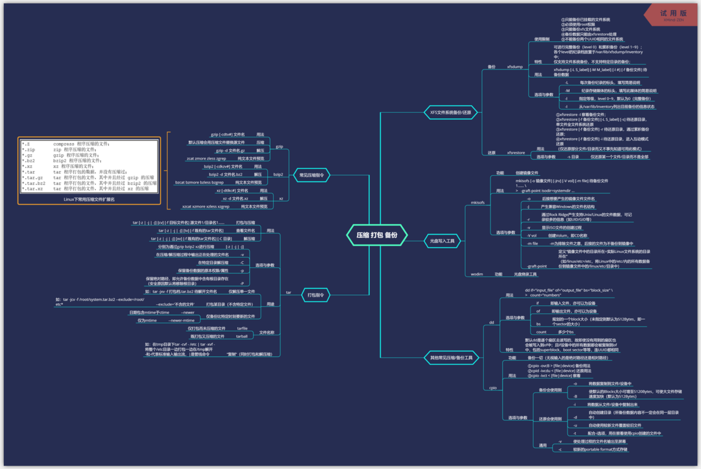

> 个人分享，学习交流

# Linux虐我千百遍 我仍待它如初恋

不想当将军的士兵不是好士兵，不学Linux的码农不是好码农。Linux这个东西，到底要不要“学”，这个问题每个人的答案都不太一样。 我个人认为的话是需要花一点时间“学”一下的。每个人的入门教材可能不太一样，但我想在国内名气比较大的应该就是鸟哥系列了吧。 我两年前一开始学的时候是买了一本第三版的基础篇，跟CLRS等众多垫显示器压泡面的书一样比砖头还厚，于是看了几章也就吃灰了， 但不可否认的是鸟哥讲得非常好非常细。这段时间觉得迫切需要好好熟悉一下Linux，但是发现现在绝大多数VPS的CentOS版本都到7.x了， 而且6.x的生命周期也快到了。学东西都是学最新的好一点，但手里的第三版很多内容“过期”了。到鸟哥网站和论坛看了一下，第四版的 早就交给出版社了却迟迟不见印刷。于是就在网上找了个第四版的机翻简体版，对照着书一起看完。机翻的质量整体不错，但仍有很多瑕疵， 比如process和program都被翻成了程序。主要的问题还是在用的过程当中，你突然需要做一件事想不起来命令，但是你有印象这个命令是 属于哪个部分该干嘛的，这时翻书和速查表之类的都不太有用。这次查到了这个命令用了但是下一次还是想不起来。所以我在看书的过程中 自己做了这些思维导图，除了可以帮自己速查外，还帮助自己建立一个真正的“框架”。有了这个模模糊糊的“框架感”，现在找命令和用 起来比起以前都顺手一些。分享出来希望能帮到一起在Linux学习路上不断踩坑填坑的朋友。

# 关于内容

- 包含png和pdf两种格式（均使用Xmind ZEN试用版输出，没钱~）

- 涵盖了《鸟哥的Linux私房菜·基础篇 4th》第5章至第16章，每1章对应1张思维导图

- 全部内容基于CentOS 7.x版本，部分6.x版本的内容我没有收录（比如文件系统内容基于xfs而不是ext），需要旧版本的自行查阅第三版

  

  > 内容预览

# 索引

|            内容            | 对应第四版章节 |                       PNG                        |                       PDF                        |
| :------------------------: | :------------: | :----------------------------------------------: | :----------------------------------------------: |
| 文件与目录的权限配置和管理 |  第5章 第6章   | [png](png/文件与目录的权限配置和管理-5th6th.png) | [pdf](pdf/文件与目录的权限配置和管理-5th6th.pdf) |
|  LInux磁盘与文件系统管理   |     第7章      |    [png](png/LInux磁盘与文件系统管理-7th.png)    |    [pdf](pdf/LInux磁盘与文件系统管理-7th.pdf)    |
|         压缩 打包          |     第8章      |        [png](png/压缩-打包-备份-7th.png)         |        [pdf](pdf/压缩-打包-备份-7th.pdf)         |
|            Vim             |     第10章     |              [png](png/Vim-9th.png)              |              [pdf](pdf/Vim-9th.pdf)              |
|            Bash            |     第11章     |             [png](png/Bash-10th.png)             |             [pdf](pdf/Bash-10th.pdf)             |
| 正则表达式/文件格式化处理  |     第12章     |  [png](png/正则表达式与文件格式化处理-11th.png)  |  [pdf](pdf/正则表达式与文件格式化处理-11th.pdf)  |
|   账号管理和ACL权限设置    |     第13章     |    [png](png/账号管理与ACL权限设置-12th.png)     |    [pdf](pdf/账号管理与ACL权限设置-12th.pdf)     |
| 磁盘配额和高级文件系统管理 |     第14章     |  [png](png/磁盘配额与高级文件系统管理-14th.png)  |  [pdf](pdf/磁盘配额与高级文件系统管理-14th.pdf)  |
|       例行性工作调度       |     第15章     |        [png](png/例行性工作调度-15th.png)        |        [pdf](pdf/例行性工作调度-15th.pdf)        |
|     程序管理和SELinux      |     第16章     |      [png](png/程序管理与SELinux-16th.png)       |      [pdf](pdf/程序管理与SELinux-16th.pdf)       |

# FAQ

- 为什么有些章节不全呢？

  因为我觉得有些章节没必要（比如新手向介绍性的），有些章节鸟哥讲得很好（比如Shell Script一章），但有比鸟哥讲得更好的~（Shell Script 推荐阅读[《Linux Shell脚本攻略 3rd》](https://item.jd.com/12333268.html)，第三版都出了~），有些章节我自己还没有整理出来， 待整理出来后会更新。

- 为什么没有Xmind的源文件？

  因为我很反感有些无良培训机构“二次开发”一下就拿别人的成果去卖。

- 如何支持？

  请购买鸟哥的书，也许会加快一下鸟哥服务器篇第四版的进度~

# 友情链接

[超级速查表 - 编程语言、框架和开发工具的速查表，单个文件包含一切你需要知道的东西](https://github.com/skywind3000/awesome-cheatsheets)

个人在用的速查表，速查bash和vim命令